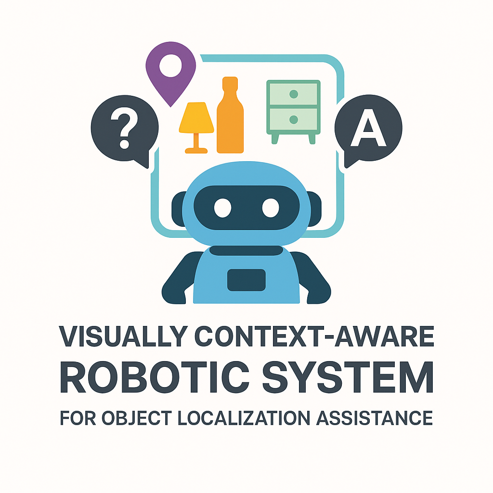
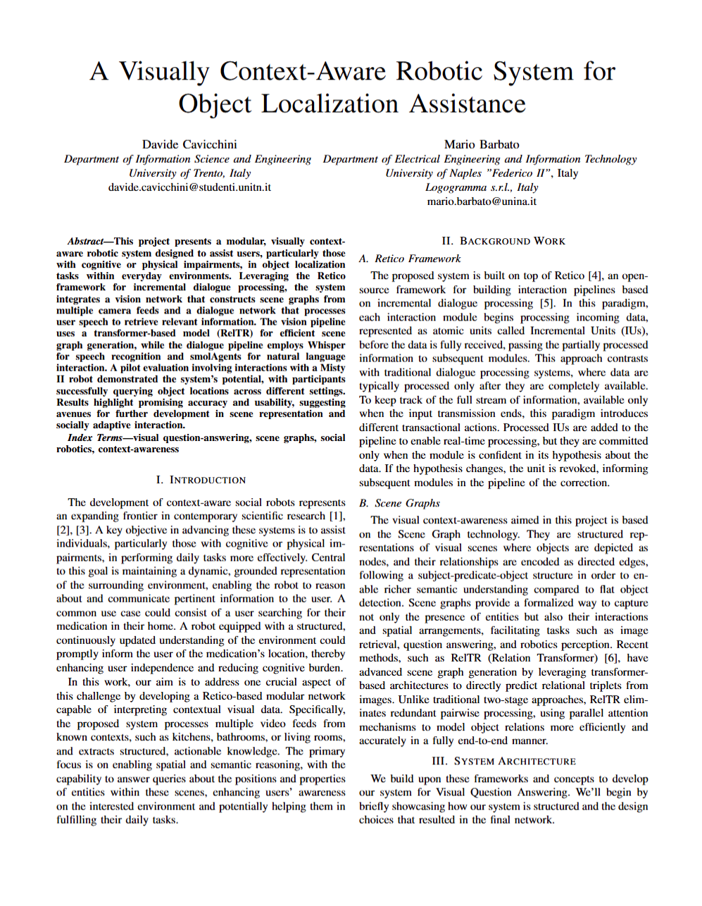

# retico-VQA


## Overview

<table>
  <tr>
    <td>
      
    </td>
    <td>
    <strong>retico-VQA</strong> is an example project designed for Visual Question Answering (VQA) tasks.
    It integrates various modules for vision, speech, and text processing using the Retico framework, enabling seamless interaction between components for incremental dialogue systems. <br>This project showcases how to build a simple VQA system that can process visual inputs, generate speech outputs, and handle real-time video streams.
    </td>
  </tr>
</table>


<p align="center">
<a href="https://github.com/DavidC001/retico-VQA/blob/main/resources/EvoMusic_report.pdf"></a>
</p>
<p align="center">
Click to download report
</p>

## Features

- **Camera Streaming**: Stream and process video feeds using the Retico framework.
- **Scene Graph Generation**: Utilize RelTR for generating scene graphs from images.
- **Visual Question Answering**: Process and answer questions based on visual inputs.
- **Spoken Dialogue Interaction**: Engage with the user in dialogue using speech recognition and synthesis.

## Installation

### Clone the Repository

```bash
# Clone the repository
git clone https://github.com/DavidC001/retico-VQA.git
cd retico-VQA
```

### Install Dependencies

```bash
# Install Python requirements
pip install -r requirements.txt
```

You also need to add to your Python path the `retico-vision` module you can download from the [Retico GitHub repository](https://github.com/retico-team/retico-vision).

### Additional Setup

For specific modules like `retico-sceneGraph`, follow their respective README files for setup instructions.

To use the script `main.py`, ensure you have the necessary environment variables set up. You can create a `.env` file in the root directory with the following content:
```
OPENAI_API_KEY=your_openai_api_key
MISTY_IP=your_misty_ip_address
```
You will also need to have a misty robot running and accessible on the specified IP address. This version lacks a proper filter of the generated responses, so you may need to silence the microphone while the robot is speaking.

## License
This project is licensed under the Apache License 2.0. See the [LICENSE](LICENSE) file for details.
